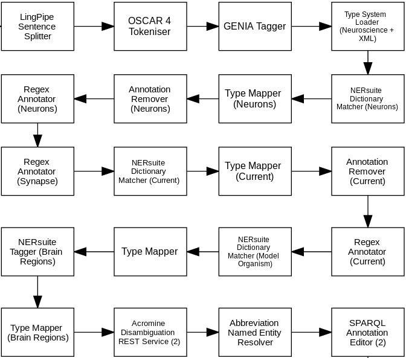

= Technical Information for Neuroscience web service

[[sect_technical_info]]

== Argo workflow for Neuroscience entities

// description of Argo
Argo is a text-mining workbench that can be used to combine UIMA components into text-mining workflows. Argo provides components for a number of text-mining purposes. In this application, we use Argo to annotate the following entities:

 * Neurons
 * Synapses
 * Ionic Currents
 * Brain Regions
 * Model Organisms

The Workflow we have created is shown below.

// pic of Argo workflow

// description of each component in workflow

The Functionality of each component is described below:

 * LingPipe Sentence Splitter: Splits the input text into sentences using a model targeted at biologiacl texts.
 * OSCAR 4 Tokeniser: Takes the input text and splits it into tokens (i.e. continuous text units broken on whitespace, punctuation, etc.) Specifically tuned for Chemical texts
 * GENIA Tagger: Used to annotate the text with tokens, parts-of-speech, etc.
 * Type System Loader: Load the Neuroscience and XML type systems.
 * NERSuite Dictionary Matcher (Neurons): Matches text against a dictionary of neuron entities.
 * Type Mapper (Neurons): Converts the output of the previous Dictionary Matcher into Neuroscience Type System.
 * Annotation Remover (Neurons): Removes the previous neuro annotations.
 * Regex Annotator (Neurons): Annotates spans of text based on regular expressions specified for neuron entities.
 * Regex Annotator (Synapse): Annotates spans of text based on regular expressions specified for synapse entities.
 * SPARQL Annotation Editor (Chemicals): Converts the output format (i.e. type) of the previous tool to a format which is required for output.
 * Species Tagger: Identifies Species names in the text
 * Duplicate Annotation Remover: Removes duplicated Species annotations
 * NERsuite Custom Tagger (Proteins): Tags the text with protein names using a custom CRF-based model.
 * Chemical Entity Recogniser (Metabolites): Idenitifies metabolite named entities in the text.
 * BioNLP ST Type System Loader (2): Makes sure that the correct Types are loaded in the Underlying Common Annotation Structure (CAS).
 * BioNLP ST WebService Writer: Writes the annotations to brat and returns the link to the file to the user.

== Technical information for the web service

