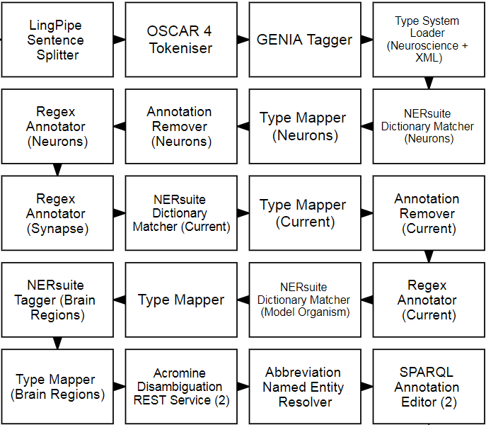

= Technical Information for Neuroscience web service

[[sect_technical_info]]

== Technical information for Neuroscience web service

// description of Argo
Argo is a text-mining workbench that can be used to combine UIMA components into text-mining workflows. Argo provides components for a number of text-mining purposes. 

The Workflow we have created is shown below.

// pic of Argo workflow
