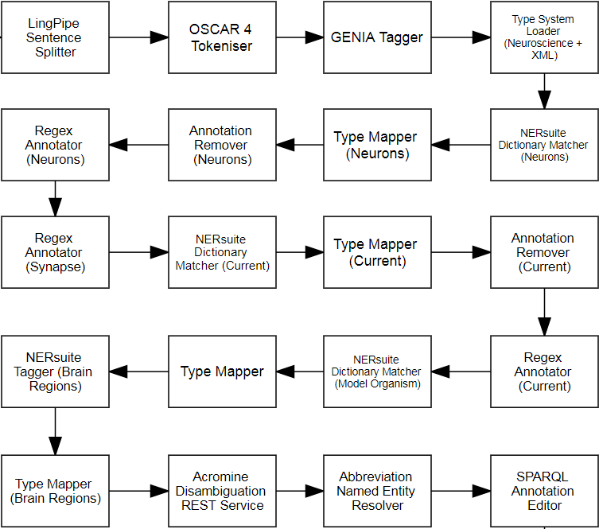

= Technical Information for Neuroscience web service

[[sect_technical_info]]

== Argo workflow for Neuroscience entities

// description of Argo
Argo is a text-mining workbench that can be used to combine UIMA components into text-mining workflows. Argo provides components for a number of text-mining purposes. In this application, we use Argo to annotate the following entities:

 * Neurons
 * Synapses
 * Ionic Currents
 * Brain Regions
 * Model Organisms

The Workflow we have created is shown below.

// pic of Argo workflow

// description of each component in workflow

The Functionality of each component is described below:

 * LingPipe Sentence Splitter: Splits the input text into sentences using a model targeted at biologiacl texts.
 * OSCAR 4 Tokeniser: Takes the input text and splits it into tokens (i.e. continuous text units broken on whitespace, punctuation, etc.) Specifically tuned for Chemical texts
 * GENIA Tagger: Used to annotate the text with tokens, parts-of-speech, etc.
 * Type System Loader: Load the Neuroscience and XML type systems.
 * NERSuite Dictionary Matcher (Neurons): Matches text against a dictionary of neuron entities.
 * Type Mapper (Neurons): Converts the output of the previous Dictionary Matcher to Neuron entities.
 * Annotation Remover (Neurons): Removes the previous neuron annotations.
 * Regex Annotator (Neurons): Annotates spans of text based on regular expressions specified for neuron entities.
 * Regex Annotator (Synapse): Annotates spans of text based on regular expressions specified for synapse entities.
 * NERSuite Dictionary Matcher (Current): Matches text against a dictionary of ionic current entities.
 * Type Mapper (Current): Converts the output of the previous Dictionary Matcher to Ionic Current entities.
 * Annotation Remover (Current): Removes the previous ionic current annotations.
 * Regex Annotator (Current): Annotates spans of text based on regular expressions specified for ionic current entities.
 * NERSuite Dictionary Matcher (Model Organism): Matches text against a dictionary of species names.
 * Type Mapper: Converts the output of the previous Dictionary Matcher to Model Organism entities.
 * NERSuite Tagger (Brain Regions): Applies a NERSuite model to annotate Brain Region entities.
 * Type Mapper (Brain Regions): Converts the output of the previous Tagger to Brain Region entities.
 * Acromine Disambiguation REST Services: Calls the REST web service for AcromineDisambiguation. It produces two types of annotations, namely AcromineShortFormAbbreviation and AcromineLongFormAbbreviation. Short form and long form annotations that share the same abbreviation id correspond to the same abbreviation.
 * Abbreviation Named Entity Resolver: Ensures that named entities are assigned to abbreviated forms, as well as their expansions.
 * SPARQL Annotation Editor: Converts the output format (i.e. type) of the previous tool to a format which is required for output.
 
== Technical information for the web service
This worflow is wrapped up as a web service compliant with the OMTD platform. More information about the specifications of an OMTD web service can be found at: https://openminted.github.io/releases/processing-web-services/1.0.0/specification. The web service is available at: http://nactem.ac.uk/api/openminted/neuroscience/ (please be noted that this is not a web page hence cannot be accessed via web browsers). 
